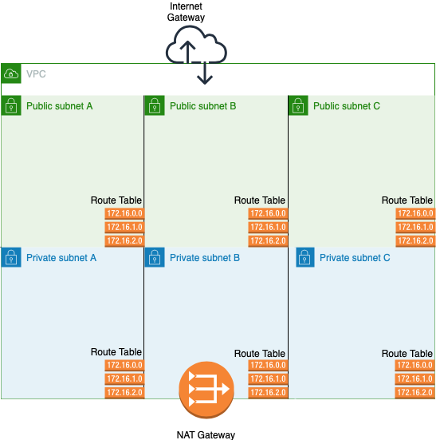

# Example VPC with AWS 

Example of running a VPC on AWS using CloudFormation
* The blog post can be found [here](https://medium.com).

# Deployment
* `aws cloudformation create-stack --stack-name vpc --template-body file://tempalte.yml --capabilities CAPABILITY_NAMED_IAM`
